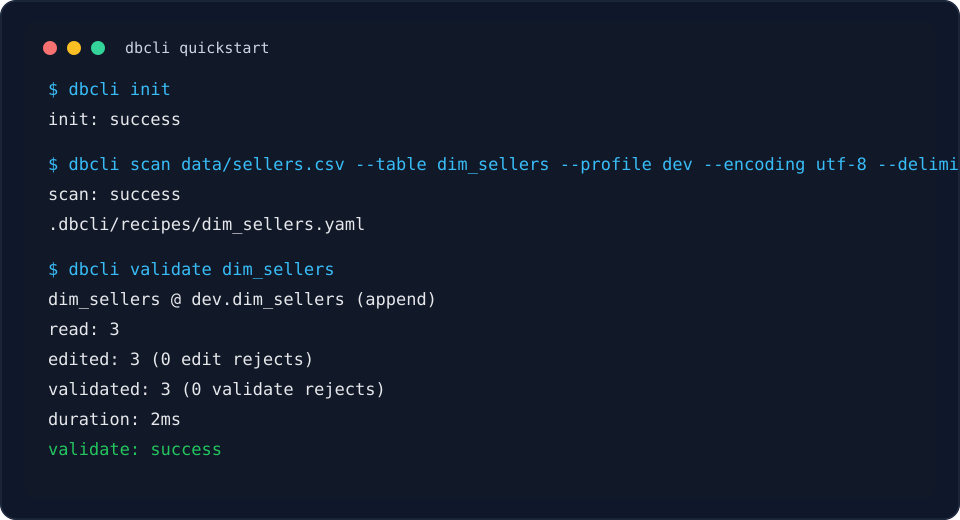

# dbcli

`dbcli` is a small, recipe-first CLI for loading CSV/XLSX files into MySQL. It keeps spreadsheet ingestion explicit, validates rows before touching the database, and writes an auditable run history for every load.



Terminal demo from a local quickstart run: initialize a project, generate a recipe, and validate rows before loading.

## Why dbcli

- Preserve CSV values as strings until a recipe explicitly casts them.
- Keep source cleanup, schema, target table, and load mode in one YAML recipe.
- Validate edits, nullability, string lengths, numeric ranges, and schema shape before writing.
- Load with `append` or atomic `replace` semantics.
- Emit CI-friendly JSON, structured diagnostics, rejects CSVs, and `.dbcli/runs.jsonl` history.

## Install

For development:

```bash
uv sync --dev
uv run dbcli --version
```

For an isolated CLI install from a checkout:

```bash
uv tool install .
```

## Setup

Create a dbcli project in the directory that owns your data recipes:

```bash
dbcli init
```

This creates:

```text
.dbcli/
├── config.toml
├── profiles.toml
├── profiles.example.toml
├── recipes/
├── rejects/
└── runs.jsonl
```

Add a MySQL profile. Passwords are stored as environment-variable references, not literal secrets:

```bash
dbcli profile add dev \
  --host localhost \
  --user dbcli \
  --database ecom_dev \
  --password-env DBCLI_DEV_PW

export DBCLI_DEV_PW='your-password'
dbcli profile test dev
```

Recommended `.gitignore` entries:

```gitignore
.dbcli/profiles.toml
.dbcli/rejects/
.dbcli/runs.jsonl
```

## Quickstart

Given a CSV:

```csv
seller_id,tier
001,VIP
002,STD
003,VIP
```

Generate a starter recipe:

```bash
dbcli scan data/sellers.csv \
  --table dim_sellers \
  --profile dev \
  --encoding utf-8 \
  --delimiter ","
```

Edit `.dbcli/recipes/dim_sellers.yaml`:

```yaml
name: dim_sellers
source:
  path: data/sellers.csv
  encoding: utf-8
  delimiter: ","
target:
  profile: dev
  table: dim_sellers
  mode: append
  charset: utf8mb4
  collation: utf8mb4_unicode_ci
  engine: InnoDB
schema:
  - {name: seller_id, type: BIGINT, nullable: false}
  - {name: tier, type: VARCHAR(16), nullable: false}
edits:
  - cast: {seller_id: {type: int}}
options:
  reject_threshold: 0.01
  batch_size: 5000
```

Validate without connecting to MySQL:

```bash
dbcli validate dim_sellers
```

Load into MySQL:

```bash
dbcli load dim_sellers
```

For CI, add `--ci --json`:

```bash
dbcli validate .dbcli/recipes/dim_sellers.yaml --ci --json
dbcli load .dbcli/recipes/dim_sellers.yaml --ci --json
```

## Load Modes

`append`

- Creates the target table when it is missing.
- Checks an existing table for schema drift.
- Inserts rows in batches inside a transaction.
- Exits `2` with `mysql.schema_drift` if the live table differs.

`replace`

- Creates a run-specific staging table.
- Loads validated rows into staging.
- Swaps staging into the target name with MySQL `RENAME TABLE`.
- Drops the backup after a successful swap.
- Cleans up staging on pre-swap failure and leaves the original target untouched.

## Inspect Results

Only `load` writes run history:

```bash
dbcli history --limit 10
dbcli show <run-id>
```

Row-level edit and validation failures are written to:

```text
.dbcli/rejects/<run-id>.csv
```

MySQL load failures are reported as structured diagnostics, not reject rows.

## Common Commands

```bash
dbcli init
dbcli profile add dev --host localhost --user dbcli --database ecom_dev --password-env DBCLI_DEV_PW
dbcli profile test dev
dbcli inspect data/sellers.csv --encoding utf-8 --delimiter ","
dbcli scan data/sellers.csv --table dim_sellers --profile dev --encoding utf-8 --delimiter ","
dbcli recipes list
dbcli recipes show dim_sellers
dbcli validate dim_sellers
dbcli load dim_sellers
dbcli history --limit 10
dbcli show <run-id>
```

## Exit Codes

| Code | Meaning |
|---:|---|
| `0` | Clean success |
| `2` | Usage error or schema drift |
| `10` | Validation, recipe, source, or config error |
| `20` | Reject threshold exceeded |
| `30` | Profile, connection, or MySQL load error |
| `1` | Unexpected internal error |

## Development

```bash
uv sync --dev
uv run pytest
uv build
```

The GitHub Actions workflow in `.github/workflows/ci.yml` runs tests and package builds on Python 3.11 and 3.12.
It also runs a live MySQL integration job that exercises append, drift detection, rollback on SQL failure, and replace mode against a MySQL service container.
